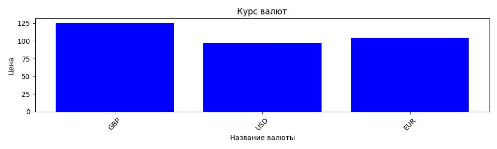

# Лабораторная работа 5
## Угарин Никита Александрович 

Был написан код, который позволяет получать значения курсов валют с сайта ЦБ РФ в объектно-ориентированном стиле. Реализован шаблон проектирования "одиночка", чтобы нельзя было создать больше чем один объект данного класса. 

Лабораторная соответствует требованиям:

Создан класс, реализованы методы для получения валюты, геттеры и сеттеры для задания входных параметров и результата, конструкторы, деструкторы для атрибутов.

Значения с плавающей точкой хранятся в формате: отдельно целая часть, отдельно - дробная часть. Реализован контроль слишком частого выполнения запросов: запрос не отправляется чаще, чем 1 раз в . 

Написаны тесты для проверки по неправильному коду возвращается словарь с неправильным id и значением None: {'R9999': None}; 1-2 теста на корректные id: проверяете название валюты (русскоязычное) и диапазон значений от 0 до 999

Реализован отдельный метод внутри класса, получающий данные о курсах валют и визуализирующий их в виде графика, который сохраняется в файле currencies.jpg.

